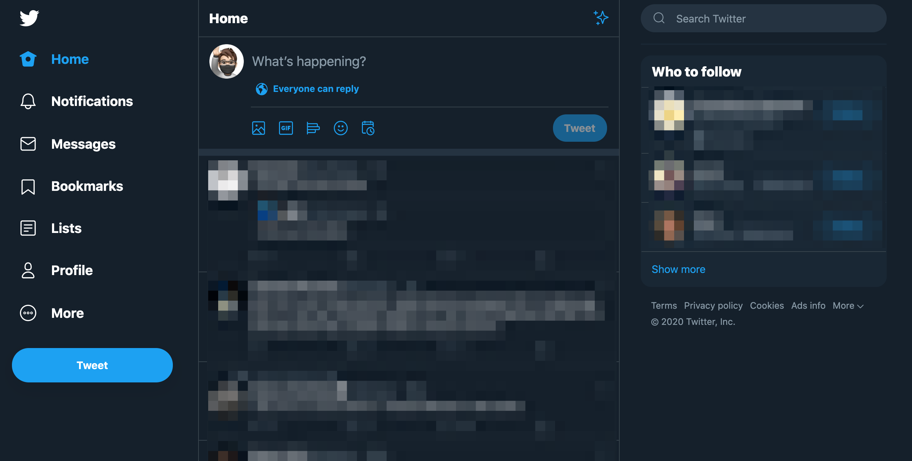

# Sanity

## What

A Chrome extension which hides the "Explore" tab and the "What's Happening" card on Twitter.

## Install

1. Download this!
2. Visit `chrome://extensions`
3. Toggle Developer Mode
4. Select "Load unpacked extension"
5. Point to the folder where you've downloaded this extension

## Why?

As documentaries like [The Social Dilemma](https://www.netflix.com/title/81254224) have shown us, social media feeds on engagement.

The more a company knows about us, the more it can curate our feeds with content that causes us to engage.

The constant dopamine hit can lead to loss of productivity, anxiety, polarization, depression, stress, and other detriments to your mental health.

At its most extreme, the engagement that social media algorithms impose can lead us down paths of radicalization and self-harm.

Twitter is a fantastic service when used correctly. You can connect with people in your hobby, industry, interests, etc. and gain a lot of value from it. Nonetheless, we shouldn't lose sight of the harm it can cause.

While we can explicitly curate our own Twitter timelines by unfollowing and muting others, there are two temptations in the front and center of Twitter: The Explore tab and What's Happening.

Sanity puts you in control.

## How

The script looks for two things:

1. The specific class that the What's Happening card uses
2. The specific anchor tag for the Explore tab

And removes each of them

It checks every half second because of two reasons:

1. The What's Happening card does not render immediately when the page loads
2. When navigating to a new page, it re-renders

## Contributions

Sanity works as long as Twitter does not change its obfuscated class names for the What's Happening tab, which I suppose can happen every time they push a new build.

In the event that happens, I will need to grab the new class.

Additionally Twitter can scramble the arrangement of those classes, which would break this extension.

Your contributions in making this more resilient are greatly appreciated.

## Support

None, sorry! I hacked this together in a couple minutes.